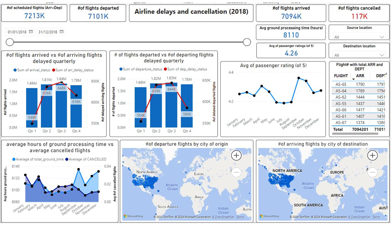

# Airport Operations Dashboard 2018

## Project Overview

The objective of this project was to develop an interactive **Power BI** dashboard using airport data from the year 2018. The dashboard aims to provide stakeholders with a comprehensive view of key performance indicators (KPIs) related to flight operations, helping them make data-driven decisions. It visualizes trends and patterns in areas such as flight arrivals, departures, cancellations, average airtime, and passenger feedback.

By analyzing historical data, the dashboard highlights significant trends, delays, and cancellations, offering insights that can improve operational efficiency and passenger satisfaction. The methodology involved data collection, cleaning, manipulation, and integration with a **MySQL** database to facilitate effective visualizations.

This project is designed to empower decision-makers with a clearer understanding of the airline's operational performance and passenger experience.

## Key Features

- **Flight Operations KPIs**: The dashboard displays important metrics such as scheduled flights, arrivals, departures, cancellations, average airtime, and passenger feedback.
- **Data Insights**: It reveals significant patterns in flight operations, focusing on delays, cancellations, and overall passenger satisfaction.
- **Interactive Visualizations**: The dashboard allows stakeholders to interact with data and view trends over time, making it easier to analyze flight operations.

## Methodology

- **Data Collection**: The data for this project was collected from publicly available airport datasets for the year 2018. The data was obtained from Kaggle's open-source dataset [Airline Delay and Cancellation Data 2009-2018](https://www.kaggle.com/datasets/yuanyuwendymu/airline-delay-and-cancellation-data-2009-2018), which contained approximately 7.3 million rows across various columns such as flight number, origin, destination, arrival time, departure time, delays, cancellations, taxi times, and more.

- **Data Cleaning and Manipulation**: The raw data was cleaned and manipulated to ensure accuracy and consistency for analysis. This process involved removing unnecessary columns, handling missing values, and converting data types where necessary.

- **Database Integration**: The cleaned data was integrated with a **MySQL** database, ensuring seamless data management and access for **Power BI** visualizations. A performance-efficient query was written to handle the large volume of data (7.3 million rows), which posed a challenge in loading and retrieving data quickly.

- **Power BI Dashboard**: The final visualizations were created in **Power BI**, utilizing various chart types to display trends, patterns, and KPIs effectively. Interactive features were integrated to help stakeholders explore data insights easily.

## Tools and Technologies Used

- **Power BI**: For creating interactive dashboards and visualizations.
- **MySQL**: For managing and integrating the data.
- **Database and Power BI Integration**: The MySQL database and Power BI were connected using **localhost** for data integration and visualization.

## Final Dashboard

Below is a snapshot of the final **Power BI** dashboard showcasing the flight operations KPIs and data insights.

